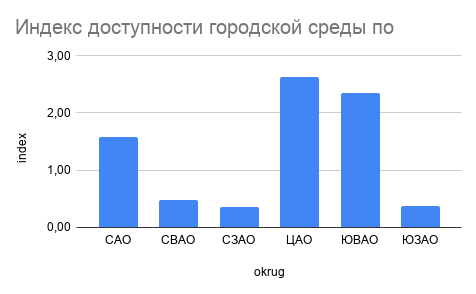
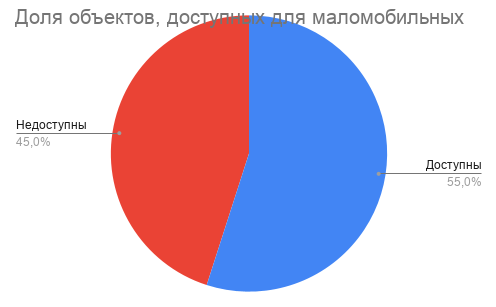
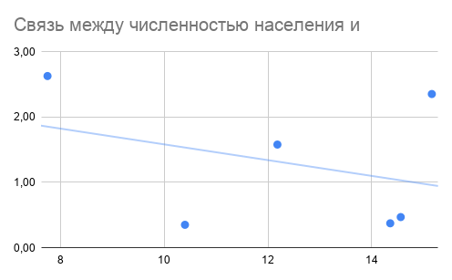
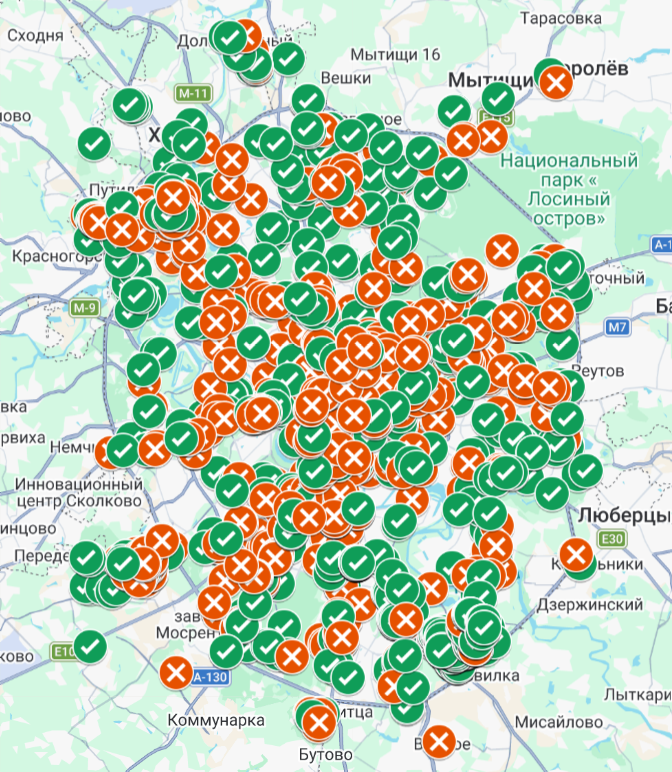

# Анализ доступности городской среды для маломобильных граждан в Москве

## Синопсис

Данное исследование посвящено анализу доступности городской среды для маломобильных граждан в Москве на основе открытых геоданных OpenStreetMap. В центре внимания — пространственное распределение объектов с признаками доступности и выявление территориальных диспропорций между административными округами.

---

## Структура репозитория

```
project/
├── README.md  
├── data/  
│   ├── raw/  
│   │   └── export (2).geojson  
│   ├── cleaned_data.csv  
│   ├── final_data.xlsx  
│   └── population.xlsx  
├── script/  
│   └── proekt.py  
├── visualizations/ 

```

---

## Актуальность

## Актуальность

Вопрос доступности городской среды для маломобильных граждан является одной из ключевых тем современной урбанистики и социальной политики. В условиях крупного мегаполиса, такого как Москва, наличие или отсутствие доступной инфраструктуры напрямую влияет на качество жизни, уровень мобильности и степень социальной интеграции значительной части населения.

Несмотря на активное развитие городской среды и внедрение стандартов безбарьерной инфраструктуры, проблема ее равномерного распределения остается открытой. На уровне отдельных районов и административных округов могут наблюдаться существенные различия: в одних территориях формируется развитая и адаптированная среда, тогда как в других сохраняется дефицит доступных объектов.

Это приводит к ситуации, при которой возможности передвижения и повседневной активности зависят не только от индивидуальных потребностей человека, но и от его места проживания. Таким образом, возникает пространственное неравенство, ограничивающее доступ к городской инфраструктуре.

Дополнительную сложность представляет то, что оценка доступности часто основывается на абсолютных показателях, не учитывающих численность населения. В результате территории с большим числом объектов могут восприниматься как более развитые, несмотря на фактический дефицит доступной среды в расчете на одного жителя.

В этом контексте анализ доступности с учетом пространственного распределения и демографических факторов становится особенно важным. Он позволяет выявить скрытые диспропорции, более точно оценить уровень развития инфраструктуры и сформировать объективное представление о состоянии городской среды.

---

## Исследовательские вопросы

1. Насколько равномерно распределена доступная среда в Москве?
2. Какие округа являются наиболее и наименее доступными?
3. Как меняется картина при учете численности населения?
4. Существует ли связь между населением округа и уровнем доступности?

---

## Данные

Источники данных

В исследовании использованы открытые геоданные платформы OpenStreetMap, содержащие информацию об объектах городской инфраструктуры и их доступности для маломобильных граждан. Ключевым признаком выступает параметр wheelchair, отражающий наличие или отсутствие безбарьерного доступа.

Дополнительно были использованы данные о численности населения административных округов Москвы, необходимые для нормализации показателей и более корректного межтерриториального сравнения.

Структура данных

В рамках проекта сформированы два основных набора данных:

cleaned_data.csv — очищенный датасет на уровне отдельных объектов, содержащий координаты (широта и долгота) и бинарный признак доступности (1 — доступно, 0 — недоступно);
final_data.xlsx — агрегированные данные по административным округам, включающие количество доступных объектов, общее число объектов, долю доступных объектов, численность населения и индекс доступности;
population.xlsx — вспомогательный файл с данными о численности населения по округам;
export.geojson — исходный (“сырой”) набор данных, полученный из OpenStreetMap.
Процесс сбора и обработки

Сбор данных осуществлялся с использованием Overpass API, позволяющего выгружать информацию из OpenStreetMap по заданным параметрам.

Первичный датасет содержал большое количество нерелевантных признаков и требовал предварительной обработки. В рамках подготовки данных были выполнены следующие этапы:

отбор ключевых переменных (координаты и признак доступности);
приведение значений wheelchair к бинарному формату (1 — доступно, 0 — нет данных или недоступно);
удаление пропусков и дублирующихся записей;
очистка и упрощение структуры таблицы;
агрегация данных по административным округам;
объединение с данными о численности населения;
расчет производных показателей (доля доступных объектов и индекс доступности).

Обработка данных выполнялась с использованием языка Python и библиотеки pandas, что позволило обеспечить воспроизводимость анализа и прозрачность всех этапов работы с данными.

Особенности и ограничения данных

Следует учитывать, что данные OpenStreetMap формируются на основе пользовательского вклада, поэтому их полнота и точность могут различаться в зависимости от территории.

Кроме того, параметр wheelchair отражает наличие доступа, но не позволяет оценить его качество или соответствие реальным условиям эксплуатации.

Также данные фиксируют наличие объектов, но не учитывают интенсивность их использования, транспортную доступность и другие факторы, влияющие на реальную доступность городской среды.


## Анализ  

Анализ проводился в несколько этапов: сначала были сопоставлены административные округа по абсолютному числу доступных объектов, затем показатели были нормализованы на численность населения, после чего результаты были дополнены визуальным и пространственным анализом. Такой подход позволил перейти от простого подсчета объектов к более содержательной оценке реальной доступности городской среды.

### 1. Сравнение округов по абсолютным показателям

На первом этапе были рассчитаны базовые показатели по каждому административному округу: количество доступных объектов, общее число объектов и доля объектов с признаком доступности. Этот анализ показал, что распределение доступной инфраструктуры по Москве является неоднородным.

Даже без учета населения заметны округа-лидеры и округа-аутсайдеры. Однако абсолютные значения сами по себе не всегда отражают реальную картину: округ с большим количеством доступных объектов может одновременно обслуживать гораздо большее число жителей, чем округ с меньшим числом объектов. Поэтому интерпретация только по количеству объектов может создавать завышенное впечатление о доступности территории.



### 2. Нормализация на численность населения

Чтобы сделать сравнение более корректным, был рассчитан индекс доступности на 10 000 жителей. Этот показатель позволяет сопоставлять округа между собой не по сырому числу объектов, а по относительной обеспеченности доступной инфраструктурой.

Именно на этом этапе становится заметно, что округа, которые выглядят благополучными в абсолютных значениях, не всегда сохраняют лидерство после нормализации. Напротив, некоторые территории с меньшим числом объектов могут демонстрировать более высокий индекс доступности, если учитывать численность населения. Это говорит о том, что равномерность распределения доступной среды в городе не совпадает с простым количеством объектов на карте.

### 3. Сравнение долей доступных объектов

Дополнительно был рассчитан показатель доли доступных объектов в общем объеме инфраструктуры округа. Он позволяет оценить не только масштаб, но и качество инфраструктурного наполнения территории.

Сравнение долей показало, что в разных округах соотношение доступных и недоступных объектов различается довольно сильно. Это означает, что проблема доступности заключается не только в количестве объектов, но и в структуре городской среды: в одних округах доступность встроена в инфраструктуру заметно лучше, чем в других.



### 4. Связь между населением и доступностью

Для проверки гипотезы о том, что более населенные округа могут иметь более развитую доступную среду, была построена диаграмма рассеяния между численностью населения и индексом доступности. График не показал выраженной линейной зависимости.

Это важный результат: доступность городской среды не растет автоматически вместе с численностью населения. Иными словами, более крупный по населению округ не обязательно оказывается лучше адаптирован для маломобильных граждан. Следовательно, развитие безбарьерной среды определяется не только демографией, но и управленческими, инфраструктурными и пространственными факторами.



### 5. Пространственный анализ

Картографическая визуализация позволила увидеть, что доступные и недоступные объекты распределены по городу неравномерно. На карте заметны участки концентрации доступной инфраструктуры, а также зоны, где таких объектов существенно меньше.

Это подтверждает, что доступность городской среды имеет не только количественный, но и пространственный характер. Для маломобильных граждан важна не просто сумма доступных объектов в городе, а их расположение относительно жилых и повседневных маршрутов. Поэтому пространственная неоднородность напрямую влияет на реальную удобность города.

[Открыть интерактивную карту](https://www.google.com/maps/d/edit?mid=1nLIBjJ9MtLoWZITTc0VHB7v8AEsnp_s&usp=sharing)


### 6. Интерпретация результатов

В целом исследование показывает, что доступность городской среды в Москве распределена неравномерно и не может быть оценена только через абсолютное число объектов. Нормализация на население и пространственная визуализация существенно меняют картину и позволяют увидеть скрытые дисбалансы.

Таким образом, можно сделать вывод, что реальный уровень доступности зависит не только от количества объектов, но и от того, как они распределены по территории города, насколько равномерно охвачены разные округа и соответствует ли инфраструктура численности населения. Это делает тему доступной среды не только социальной, но и ярко выраженно пространственной проблемой.

## Референсы

* World Health Organization (WHO). *Global Report on Disability and Health* — исследование, посвященное проблемам доступности среды и барьеров для маломобильных граждан.

* United Nations. *Disability and Development Report* — отчет о глобальных проблемах доступности городской среды и социальной интеграции.

* Gehl, J. *Cities for People* — работа о влиянии городской среды на качество жизни и доступность общественных пространств.


## Инструменты

* **Python (pandas)** — для очистки, обработки и агрегации данных, а также расчета ключевых показателей доступности;
* **Overpass API / Overpass Turbo** — для сбора данных из OpenStreetMap по заданным параметрам;
* **Google Sheets** — для анализа данных, построения сводных таблиц и создания визуализаций;
* **Google My Maps** — для построения интерактивной карты и пространственного анализа;
* **OpenStreetMap** — основной источник геоданных;
* **ChatGPT** — как вспомогательный инструмент для формулировок, обработки данных и написания кода.

